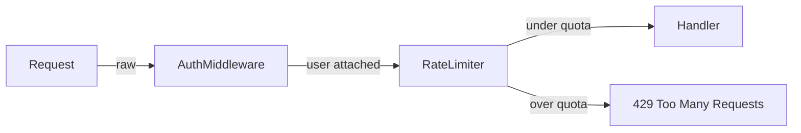

Load `skills/shared/interaction-patterns/SKILL.md` and use `AskUserQuestion` for every question with a finite set of answers — never a plain-text prompt. Load `skills/shared/output-format/SKILL.md` and apply it to all output. Read `.dev-team-agents/user-data/preferences.json` → `language` (default `en`) and write the explanation, the quiz, and every option label in that language.

**This command does not load `current-context` and does not spawn agents.** Both follow from the same fact: the terms come from the conversation you are already in. A subagent receives only the prompt text, so it would lose exactly what makes the explanation worth asking for — the message where the term appeared, the file it was about, the decision it belonged to. Answer in the main context.

**Direct, not exhaustive.** Someone hit a word they did not know and wants to get back to what they were doing. Every limit below is a ceiling, not a target, and a term that fits in less should take less.

---

## Step 1 — Resolve the term list

`$ARGUMENTS` is a comma-separated list of terms: `/devteam:explain SPA` or `/devteam:explain SPA, SSR, tenant, middleware`.

- Split on commas, trim whitespace, keep the user's original casing when displaying the term.
- If `$ARGUMENTS` is empty, ask in free text which term to explain. Do not guess from the last message.
- Above six terms, explain the first six and name the ones left out so the user can ask again. Never truncate silently.

---

## Step 2 — Ground each term before writing anything

For each term, resolve top-down and stop at the first match:

1. **It appeared in this session** — find where, and let that reading win. If the user saw "middleware" in a review of their own HTTP pipeline, explain that middleware, not the generic idea.
2. **It appears in the project** — `grep` for it. Use what you find as the example and cite `file:line`.
3. **Neither** — explain it generally, and say so in one clause instead of inventing a link to the project.

Never explain a term in a sense the session did not use. When a term carries more than one meaning in context — a `tenant` in multi-tenancy against a domain entity named Tenant — give both readings, the one the session used first.

---

## Step 3 — Write one block per term

### `<term>` — `<expansion>`

**Expand acronyms and initialisms on the heading line**, before anything else: `SPA — Single-Page Application`. A term borrowed from another language or another field gets its literal meaning the same way. When it is neither, drop the dash.

**What it is** — two sentences; three only when the term genuinely has two halves. Never define jargon with more jargon: if the definition needs a second term the user did not ask about, explain that one in a subordinate clause or choose a different word.

**The problem it solves** — one or two sentences: what someone would be doing instead if it did not exist, and why that hurts. Never the definition restated in different words. If you cannot name what breaks without it, you have not found the problem yet.

**Example** — the shortest thing that shows the point.

- A code concept: a fenced block in the project's actual language and framework, detected from the repo — never defaulting to JavaScript. Cut every line the point does not need, imports and error handling included.
- Not a code concept: one concrete scenario with real names or numbers, not an abstract restatement.

**In this project** — only when Step 2 found it. One line with `file:line`. Drop the heading entirely when there is nothing to say; an empty section reads as a failed lookup.

**Never write** an opening line about the question, a restatement of what was asked, a closing summary, an "in short" paragraph, or a caveat that the topic goes deeper than this. The quiz offer is the ending.

---

## Step 4 — Draw it, but only when the shape is the explanation

A diagram earns its place when the term **is** a shape and prose would spend sentences rebuilding it. Then draw one. Otherwise skip this step and lose nothing.

| Draw when the term is | Example terms | Mermaid type |
|---|---|---|
| A flow through stages | middleware, CI pipeline, request lifecycle | `flowchart LR` |
| Two paths worth comparing | SSR against CSR, sync against async, monolith against microservices | `flowchart TB`, one branch each |
| An exchange between parties | OAuth, JWT refresh, webhook, TLS handshake | `sequenceDiagram` |
| Containment or hierarchy | multi-tenancy, bounded context, VPC and subnets | `flowchart TB` with `subgraph` |
| A lifecycle with named states | saga, order status, connection pooling | `stateDiagram-v2` |

**Do not draw for a definition, a property, or a convention.** `idempotent`, `DTO`, `immutable`, `camelCase`, `tech debt`, `linter` — a box with the word inside it teaches nothing, and now there are two things to read instead of one. When in doubt, do not draw: a missing diagram costs a sentence, a pointless one costs attention and makes the answer feel long, which is the exact failure this command exists to avoid.

**Rules for the diagram:**

- A fenced code block tagged `mermaid`. It renders as a diagram where mermaid is supported and stays readable as text where it is not.
- **Three to seven nodes.** A diagram that has to be studied has failed. If the concept needs more than seven, you are drawing the system instead of the term.
- Label the edges with what actually moves — `request`, `token`, `retry after 3s` — never `next` or a bare line.
- Use the project's real names when Step 2 found them: `AuthMiddleware` beats `Middleware 1`.
- One diagram per term at most, placed after **The problem it solves** so the shape frames the example. Never a second diagram to explain the first.

````markdown

````

---

## Step 5 — Offer the quiz (mandatory)

**Always close with this.** It is not conditional on how long the explanation was, how simple the term looked, or whether the user seemed satisfied.

Use `AskUserQuestion` (single-select):

> "Want to go deeper with an interactive quiz?"

- **Yes, cover everything** — a quiz across all the terms just explained
- **Yes, one term only** — ask which term, then quiz on that one
- **No, this is enough** — stop here

On the third option, print one line confirming it and end. Do not re-offer.

---

## Step 6 — Run the quiz (only when accepted)

**Shape.** Three to five questions per term, capped at eight questions total. Ask them **one at a time** with `AskUserQuestion` (single-select, three or four options). Never show the next question before the current one is answered, and never reveal how many are left in a way that lets the user skip ahead.

**Question quality.** Test application, not recall. A question that can be answered by re-reading the definition teaches nothing — put the term in a situation and ask what follows from it.

- Weak: "What does SSR stand for?"
- Strong: "A page shows an empty shell for a second, then fills in. Which rendering strategy is that, and what would the other one have shown instead?"

**Distractors.** Exactly one option is right. Each wrong option is a **real misconception** about the term, not filler — the confusion with a neighbouring concept, the inverted causality, the right idea applied at the wrong layer.

**After each answer**, in two or three lines:

- Say plainly whether it was right.
- Say why the correct answer is correct.
- When it was wrong, name the misconception the chosen option represents. That naming is the teaching moment — do not replace it with "not quite, the answer is B".

**At the end:**

- Score, as a plain count.
- One line per concept that was missed, stating what to revisit.
- When at least one answer was wrong, offer with `AskUserQuestion` to re-explain the weakest term with a different example, or to stop.

---

## Notes

- This command reads. It never edits files, never commits, and never runs the project's tools. If the explanation reveals an actual bug or a real gap in the code, say so in one line at the end and let the user decide which command to reach for — do not fix it here.
- If a requested term genuinely has no meaning in this project or in general software vocabulary, say that directly instead of producing a plausible definition. A confident wrong explanation is worse than "I do not know this one — where did you see it?".

Terms: $ARGUMENTS
